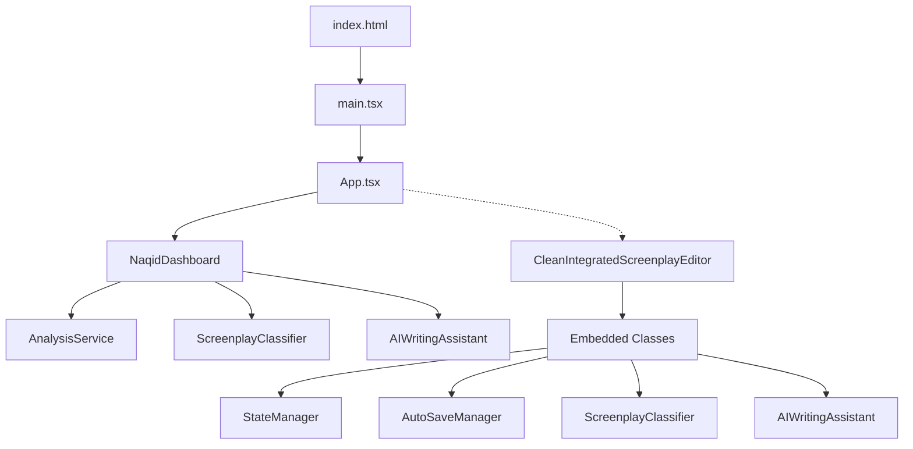

# العمارة التقنية لمحرر السيناريو العربي

## طبقات المشروع

### 1. طبقة العرض (UI Layer)
```
src/components/
├── editor/CleanIntegratedScreenplayEditor.tsx  # المحرر الأساسي
├── editor/AdvancedAgentsPopup.tsx             # واجهة الوكلاء الذكيين
└── naqid/NaqidDashboard.tsx                   # لوحة التحليل (الحالية)
```

### 2. طبقة الخدمات (Services Layer)
```
src/services/
├── AnalysisService.ts      # خدمة تحليل السيناريوهات
├── test-classifier.ts      # اختبارات المصنف
└── counter.ts              # أدوات القياس
```

### 3. طبقة الوكلاء الذكيين (Agents Layer)
```
src/agents/                 # مستبعدة من التكوين الحالي
├── analysis/               # وكلاء التحليل
├── generation/             # وكلاء التوليد
├── evaluation/             # وكلاء التقييم
└── transformation/         # وكلاء التحويل
```

### 4. طبقة التهيئة (Configuration Layer)
```
src/config/                 # مستبعدة من التكوين الحالي
└── agentConfigs.ts         # تهيئة الوكلاء
```

### 5. طبقة معالجة النصوص (Text Processing Layer)
```
src/modules/text/
└── domTextReplacement.ts   # معالجة واستبدال النصوص
```

## مخطط تدفق البيانات

### الواجهة الحالية (NaqidDashboard)
```
index.html → main.tsx → App.tsx → NaqidDashboard.tsx
                                      ↓
                                AnalysisService.ts
                                      ↓
                         ScreenplayClassifier (from Editor)
                                      ↓
                            AIWritingAssistant (from Editor)
```

### المحرر الكامل (غير مفعل)
```
index.html → main.tsx → App.tsx → CleanIntegratedScreenplayEditor.tsx
                                      ↓
                              [Embedded Classes]
                              ├── StateManager
                              ├── AutoSaveManager
                              ├── ScreenplayClassifier
                              ├── AIWritingAssistant
                              └── AdvancedSearchEngine
```

## الاعتماديات الرئيسية

### تبعيات الإنتاج
- **React 19.1.1**: مكتبة UI الأساسية
- **React-DOM 19.1.1**: لعرض React في DOM
- **Lucide-React 0.544.0**: مكتبة الأيقونات

### تبعيات التطوير
- **TypeScript 5.8.3**: النظام الكتابي
- **Vite 7.1.7**: أداة البناء والتطوير
- **Tailwind CSS 4.1.13**: إطار عمل CSS
- **PostCSS & Autoprefixer**: معالجة CSS

## حدود الوحدات

### 1. فصل الاهتمامات
- **المكونات**: UI وتفاعل المستخدم فقط
- **الخدمات**: منطق العمليات والحسابات
- **الوكلاء**: ذكاء اصطناعي ومعالجة متقدمة
- **الأدوات**: وظائف مساعدة عامة

### 2. نمط الاستيراد
- المكونات تستورد من الخدمات
- الخدمات لا تستورد من المكونات
- الوكلاء معزولون ومستبعدون حالياً

## اعتبارات RTL والطباعة العربية

### 1. دعم RTL
```css
direction: 'rtl'            # اتجاه النص
text-align: right           # محاذاة النص
font-family: Arabic fonts   # خطوط عربية
```

### 2. تصنيف النص العربي
```typescript
// أنماط المشاهد
SCENE_HEADER: /^مشهد\s+\d+/

// أسماء الشخصيات
CHARACTER_NAME: /^[أ-ي\s]+:$/

// أفعال الحركة (60+ فعل عربي)
ACTION_VERBS: ['يدخل', 'يخرج', 'ينظر', ...]
```

### 3. معالجة النصوص المختلطة
- دعم النصوص العربية والإنجليزية
- معالجة علامات الترقيم العربية
- تنسيق أرقام المشاهد والصفحات

## خريطة الروابط النسبية

- [المحرر الأساسي](../../src/components/editor/CleanIntegratedScreenplayEditor.tsx)
- [لوحة التحليل](../../src/components/naqid/NaqidDashboard.tsx)
- [خدمة التحليل](../../src/services/AnalysisService.ts)
- [معالج النصوص](../../src/modules/text/domTextReplacement.ts)
- [أنواع البيانات](../../src/types/types.ts)

## مخطط الاستدعاءات المبسط

